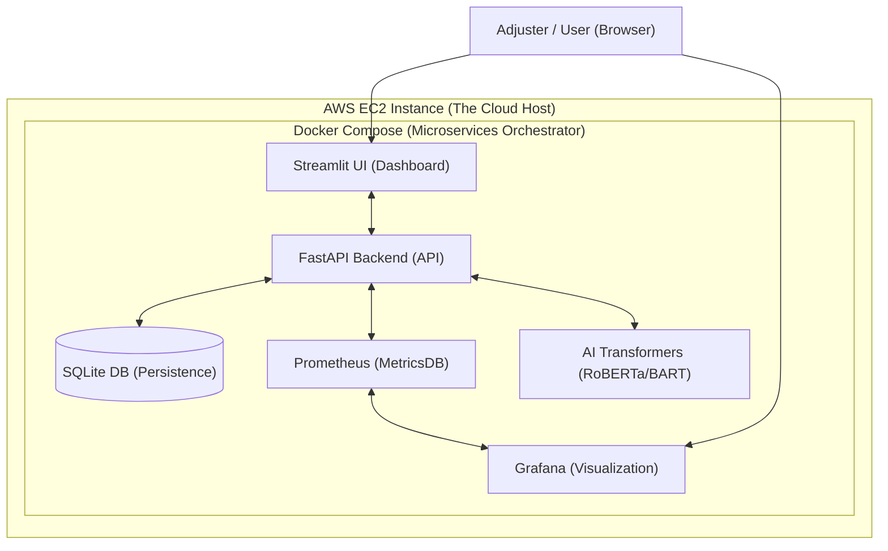

## 1. System Architecture Diagram

This diagram shows how the components interact across the cloud and local containers:

---

## 2. Is this a Microservices Architecture?
**YES.** This is a **Containerized Microservices Architecture.**
*   **Definition:** Instead of one large program (Monolith), the system is broken into small, independent services.
*   **Our Services:** 
    1.  `API Service`: Handles AI logic and Database.
    2.  `Dashboard Service`: The Customer/Adjuster interface.
    3.  `Prometheus Service`: The Metric database.
    4.  `Grafana Service`: The Visualization layer.
*   **Benefit:** **Scalability.** If we get 1,000,000 users, we can scale just the `API` service without touching the `Dashboard`.

---

## 2. The Tech Stack Theory

### A. FastAPI (Backend)
*   **Keywords:** *Asynchronous (ASGI), Pydantic validation, Automatic OpenAPI (Swagger).*
*   **Theory:** Unlike older frameworks, FastAPI uses Python type-hints to validate data at the gate. It is "Asynchronous," meaning it doesn't wait for one AI request to finish before starting another—it can handle thousands of concurrent users.

### B. Prometheus & Grafana (Observability)
*   **Prometheus:** A **Time-Series Database**. It operates on a **Pull-Model** (it reaches out to the API to pull data).
*   **Grafana:** A **Visualization Engine**. It doesn't store data; it queries Prometheus and renders it into human-readable dashboards.
*   **Metric Types Used:** 
    *   *Counter:* Total requests.
    *   *Histogram:* Latency (how many seconds the AI took).
    *   *Gauges:* Current system health.

### C. The AI Model Ensemble (The Brain)
We use a **Multi-Model Strategy** rather than one single LLM for better precision:
1.  **RoBERTa (Sentiment Analyst):** A BERT-based model specialized for social-media/short-text sentiment. We use it to detect claimant anger and scale "Claim Urgency."
2.  **BART (Zero-Shot Classifier):** A model that can categorize text into labels (like *Auto, Theft, Fire*) without being specifically trained on our dataset.
3.  **Groq/Llama3 (Synthesizer):** The Large Language Model that takes the raw data and turns it into a professional, empathetic insurance draft.

---

## 3. The Core Concept: Human-Driven Memory
*   **The Problem:** AI often makes "hallucinations" or mistakes in insurance.
*   **Our Solution:** The **Human-in-the-loop Feedback Loop.**
    *   AI generates a draft.
    *   **Licensed Adjuster** (Human) edits and approves it.
    *   **LangMem** captures the *final approved* version.
    *   Next time a similar claim comes, the AI retrieves the *Human-Approved* history, not just its own previous guesses. This is called **Episodic Long-Term Memory.**

---

## 4. How the "Real Data" Helps
By using the **Kaggle Automobile Insurance Dataset** (1,000 rows), we proved:
1.  The classifier can handle diverse claim types.
2.  The memory system can deduplicate and store high-volume historical resolutions safely.
3.  The system is robust against irregular formatting found in real-world CSVs.

---

## 5. Deployment Theory (EC2 & Docker)
*   **Docker:** Uses **Containerization** to ensure "It works on my machine" means "It works on the server."
*   **EC2:** An **IaaS (Infrastructure as a Service)** product from AWS. We use Linux-based EC2 instances to host our Docker containers, allowing for 24/7 availability.
